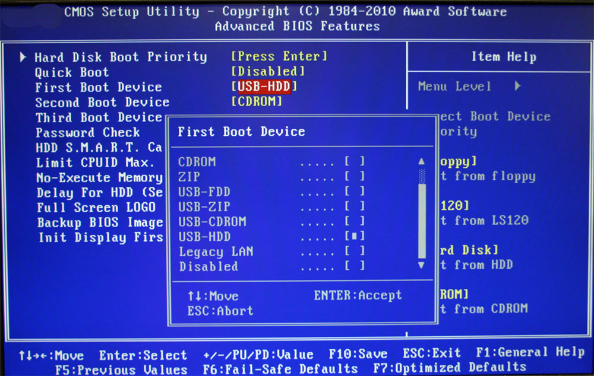

+++
title = 'GNU/Linux 的简单启动流程'
date = 2025-03-06T13:30:49+08:00
draft = false
toc = true
author = 'fermata'
+++

## Disclamer

- 由于我个人才疏学浅，讲义中的内容可能含有大量错误，如果你发现了哪里有不对的地方，请直接联系我。
- 讲义中的内容**大量**参考了 Linux 文档，维基百科以及一些教科书。
- 可能这些内容对**应试方面没有任何帮助**。

## 操作系统是如何启动的

在游戏《Slay the Spire》中有这样一个角色：  
他拥有一个庞大的卡组，卡组中的每一部分都可以是不可或缺的存在。他的卡往往需要七八个回合才能完成“启动”，常被誉为和“大头”比启动的角色。。。


咳咳，让我们回到正题。  
在现实生活中，一个计算机也往往需要多个阶段才能完成启动，这些阶段往往取决于你的计算机的架构（如 x86, mips, arm64 等）和你所使用的操作系统的设计。
但如果你以一个更高的视角来看的话，我们可以将这些操作系统的启动流程分为 4 个阶段：  

1. 引导阶段 - Stage 1 -- UEFI/BIOS
2. 启动阶段 - Stage 2 -- Bootloader -> Grub/Windows 启动管理器等
3. 内核启动 - Stage 3 -- kernel stage -> initramfs/vmlinuz...
4. 应用启动 - Stage 4 -- system applications -> init...

如果用一句话来概括的话，就是从简单到复杂，从小到大，一步步搭建出了一个完整的操作系统环境。

## Stage1

Stage1 的程序往往非常小，负责的功能也非常简单，他们常常是由电脑厂商或者主板厂商编写。
并放置在一块很小的 ROM (Read Only Memory) 上。每当计算机启动或者重置时，CPU 都会固定引导执行这块区域的代码。  

这段代码会去执行一些系统自检（POST），初始化外设等操作，
在这之后，若系统没有问题，则会将磁盘（USB，CD，在以前也可以是软盘）中指定的一块区域内的代码加载到内存中执行，进入启动的第二阶段。  

在现代的 x86/x86_64 系统上，这段固件程序往往被称为 BIOS/UEFI 接口。
BIOS 规范最早可以追溯到 1981 年的 IBM PC 上，
而 UEFI 则最早可以追塞到 1990 年 Intel 针对 BIOS 的设计限制所做的一个优化后的实现。  

> BIOS - Basic Input/Output System  
> UEFI - Unified Extensible Firmware Interface




不同于现代 PC ，历史上的 BIOS 有着至关重要的作用，
所以很多旧操作系统（MS-DOS）常常非常依赖 BIOS 的接口配置（键盘中断，磁盘 I/O 等），
但是现代的操作系统为了提供更加高级的功能并且提高系统的兼容性，
往往在后续启动的阶段中就用自己的实现替换了 BIOS 提供的一些中断设置和 IO 接口配置。
而且在现代的 UEFI 设置中，除去最基本的配置启动项顺序/位置以外，很多厂家还添加了包括电脑 CPU/RAM 性能监测，超频， 安全启动签名等功能。

<!--
如果常看 B 站维修电脑的视频的话，大家或许也会对 “刷 BIOS” 这个词比较熟悉，
那什么是 “刷 BIOS” 呢？ 为什么要 “刷 BIOS” 呢？  

简而言之，刷 BIOS 其实就是修改储存 BIOS 程序的芯片里的内容。
（以前的电脑用的是 ROM 储存，但是现在很多的硬件厂家为了能后期更改 BIOS 而将其储存在了一块 flash/eeprom 中）
通过刷写 BIOS，就能绕过很多厂商对于硬件型号，设备编号等的限制，从而使得电脑硬件能够继续启动。

但事实上，大部分的电脑都已经在使用 UEFI 接口了，所以“刷 BIOS”这个名称其实也不是那么准确。  
-->

> Tips  
> 传统的 BIOS 使用的是 MBR 分区表，而现代的 UEFI 使用的是 GPT 分区表。  
> 什么是分区表？ 这两者又有什么区别？  
> 大家可以上网搜索了解一下，答案会在后续（可能的）文件系统课中揭晓。  

## Stage2

细心的同学可能已经发现了，我们在上一个 Stage 中指定了一段代码，而这段代码是什么呢？  
答案也很显而易见，这段代码就是我们的操作系统特定的启动程序，也常被称为 Bootloader。  

以 x86/x86_64 架构为例，在加载 Bootloader 的时候又会分为两个阶段，第一个阶段会加载硬件供应商特定的代码和一个**分区表**，
这个分区表会告诉 Bootloader 当前计算机的分区情况，
从而让他能够去硬盘中找到分区中储存的操作系统内核，并将操作系统内核的**压缩文件**加载到内存中。  

如果大家还记得之前安装系统的详细步骤的话，那应该会对给磁盘分区这一步比较熟悉。  
常见的 EFI 分区方案是这样的:  

```shell
Device              Start        End    Sectors   Size Type
/dev/nvme0n1p1       2048    4196351    4194304     2G EFI System
/dev/nvme0n1p2    4196352   71305215   67108864    32G Linux swap
/dev/nvme0n1p3   71305216 3292530687 3221225472   1.5T Linux filesystem
```

EFI (Extensible Firmware Interface) 是 UEFI 的一个规范，
他规定了在硬盘的第一个 efi 标签的 VFAT 文件系统的分区中存放系统启动所需的文件，
这里也就是我们所说的 Bootloader。

> 传统上，内核位于文件系统层次结构的根目录中;  
> 然而，由于 bootloader 必须使用 BIOS 驱动程序来访问硬盘，
> 因此某些 i386 系统的限制意味着只有硬盘的前 1024 个柱面是可寻址的。
>
> 为了克服这个问题，Linux 鼓励用户在驱动器的开头创建一个分区，
> 专门用于存储引导加载程序和内核相关文件。

我们以 Linux 下最常用的 GRUB - GNU GRand Unified Bootloader 为例。  
当你正确配置完 grub 之后，你的 efi 分区里的内容应该大概是这样的：

```shell
/efi
└── EFI
    └── gentoo
        └── grubx64.efi
```

而在 Boot 目录下，我们可以看到 grub 引导的剩余文件（此处省略了部分内容）：

```shell
/boot
├── amd-uc.img
├── config-6.10.12-gentoo-dist
├── grub
│   ├── grub.cfg
│   └── x86_64-efi
│       └── normal.mod
├── initramfs-6.10.12-gentoo-dist.img
├── System.map-6.10.12-gentoo-dist
└── vmlinuz-6.10.12-gentoo-dist
```

GRUB 提供了一个菜单，用户可以在其中从 grub-install 找到的操作系统中进行选择。
选择引导选项后，GRUB 会将选定的内核加载到内存中，并将控制权传递给内核。  
或者，GRUB 可以使用链式加载将引导进程的控制权传递给另一个引导加载程序。
是的， grub 在打开 os-prober 之后是可以引导 windows 甚至其他操作系统的。

Ok，那接下来我们就来看看 BIOS 是如何把一个 GNU/Linux 系统拉起来的把。

首先，grub 会加载 vmlinuz（压缩的 Linux 内核）到内存。
之后，如果系统需要 initramfs，引导程序会同时将 initramfs（初始内存文件系统）加载到内存，并将其地址传递给内核。


### vmlinuz


> Notes  
> vmlinux 是一个**静态链接**的可执行文件，它包含 Linux 支持的一种对象文件格式的 Linux 内核，
> 但必须通过添加多重引导头、引导扇区和安装例程，在将其用作作系统内核之前使其可引导。

当你在 grub 中选中 Linux 的系统启动项时， 
grub 就会将选中的 `vmlinuz` **解压**并加载到内存中，并初始化核心子系统（如调度器、内存管理）。  
在这个阶段结束后，内核会尝试加载临时根文件系统（initrd/initramfs）。
**注意，此时内核还没有加载完整的磁盘和文件系统驱动。**

> 在以前，UNIX 平台将内核映像称为 /unix。
> 随着虚拟内存的发展，支持此功能的内核被赋予了 vm- 前缀以区分它们。
> 名称 vmlinux 是 vmunix 的变体，而在 vmlinuz 中，末尾的字母 z 表示它是压缩的（例如 gzip）。

```shell
❯ file /boot/vmlinuz-6.10.12-gentoo-dist
/boot/vmlinuz-6.10.12-gentoo-dist: Linux kernel x86 boot executable bzImage, version 6.10.12-gentoo-dist (portage@localhost) #1 SMP PREEMPT_DYNAMIC Thu Oct  3 18:59:52 CST 2024, RO-rootFS, swap_dev 0X12, Normal VGA

❯ strings vmlinux | grep "\<sbin\>"
/sbin/reboot
/sbin/request-key
/sbin/init
/sbin/cpuset_release_agent
PATH=/sbin:/bin:/usr/sbin:/usr/bin
PATH=/sbin:/usr/sbin:/bin:/usr/bin
/sbin/poweroff
/sbin/modprobe

❯ readelf -h vmlinux 
ELF Header:
  Magic:   7f 45 4c 46 02 01 01 00 00 00 00 00 00 00 00 00 
  Class:                             ELF64
  Data:                              2's complement, little endian
  Version:                           1 (current)
  OS/ABI:                            UNIX - System V
  ABI Version:                       0
  Type:                              EXEC (Executable file)
  Machine:                           Advanced Micro Devices X86-64
  Version:                           0x1
  Entry point address:               0x100007a
  Start of program headers:          64 (bytes into file)
  Start of section headers:          458719896 (bytes into file)
  Flags:                             0x0
  Size of this header:               64 (bytes)
  Size of program headers:           56 (bytes)
  Number of program headers:         5
  Size of section headers:           64 (bytes)
  Number of section headers:         54
  Section header string table index: 53
```

```shell
# From https://www.kernel.org/doc/html/latest/arch/x86/boot.html
              ~                        ~
              |  Protected-mode kernel |
100000        +------------------------+
              |  I/O memory hole       |
0A0000        +------------------------+
              |  Reserved for BIOS     |      Leave as much as possible unused
              ~                        ~
              |  Command line          |      (Can also be below the X+10000 mark)
X+10000       +------------------------+
              |  Stack/heap            |      For use by the kernel real-mode code.
X+08000       +------------------------+
              |  Kernel setup          |      The kernel real-mode code.
              |  Kernel boot sector    |      The kernel legacy boot sector.
X             +------------------------+
              |  Boot loader           |      <- Boot sector entry point 0000:7C00
001000        +------------------------+
              |  Reserved for MBR/BIOS |
000800        +------------------------+
              |  Typically used by MBR |
000600        +------------------------+
              |  BIOS use only         |
000000        +------------------------+

... where the address X is as low as the design of the boot loader permits.
```

### System.map

在 Linux 中，System.map 文件是内核使用的符号表。  
由于地址可能会因一个版本而异，因此会为内核的每个版本生成一个新的 System.map。

因此， Linux 内核的编译流程是 Source code --compiling--> vmlinux
 --stripping/compressing--> System.map && vmlinuz

在内核中，由于所有函数都是以地址引用的，所以 Linux 内核本身不会使用符号名，但是对于有些其他的程序，
如果没有符号名的话，产生的输出往往会有很大的错误，会给内核调试带来很大的麻烦。

### initrd/initramfs

在 initrd 方案中，映像可以是文件系统映像（可选压缩），它在特殊的块设备 （/dev/ram） 中可用，然后作为初始根文件系统挂载。  
该文件系统的驱动程序必须静态编译到内核中。一旦初始根文件系统启动，内核将 /linuxrc 作为其第一个进程执行;
当它退出时，内核会假设真正的根文件系统已经挂载，并执行 /sbin/init 开始正常的用户空间引导过程。

在 initramfs 方案（从 Linux 内核 2.6.13 开始可用）中，映像可以是 [cpio][1] 存档（可选压缩）或此类存档的串联。
内核将存档解压缩到 tmpfs 的特殊实例中，该实例成为初始根文件系统。  
此方案的优点是不需要将中间文件系统或块驱动程序编译到内核中。
在 initramfs 方案中，内核将 /init 作为其预期不会退出的第一个进程执行。

我们可以使用命令 `lsinitcpio /boot/initramfs-linux.img` 查看里面的内容 。
事实上，它包含一个简化的根系统，其中包含各种辅助工具：

但不管是什么方案，它们两者都起到了提供临时的根文件系统，根据用户的配置（/etc/fstab），辅助挂载真实根文件系统的作用。
它们可以被看作是一个临时的“桥梁”，负责在真实根文件系统可用前提供必要的驱动和工具，完成从内核和启动到用户空间初始化的过渡。  

[1]: <https://www.kernel.org/doc/html/latest/filesystems/ramfs-rootfs-initramfs.html> "initramfs"

## Init system

在基于 Unix 的计算机作系统中，init（初始化的缩写）是作系统启动期间启动的第一个进程。
Init 是一个守护进程，它会一直运行，直到系统关闭。
它是所有其他进程的直接或间接祖先，它的主要功能是为系统启动必要的服务和组件，并最终生成一个 tty 供用户登录系统。  
init 在引导过程中由内核启动；如果内核无法启动它，就会发生内核 panic，或者它应该由于任何原因而死亡。
Init 通常被分配进程标识符 1。

```shell
❯ ps 1
  PID TTY      STAT   TIME COMMAND
    1 ?        Ss     0:01 init [3]
```

### Daemon or Demon?

在多任务计算机作系统中，守护进程是作为后台进程运行，而不是由交互式用户直接控制的程序。
传统上，守护进程的进程名称以字母 d 结尾，以阐明该进程实际上是守护进程，以及区分守护进程和普通计算机程序。  
例如，syslogd 是实现系统日志记录工具的守护程序，而 sshd 是为传入的 SSH 连接提供服务的守护程序。

> 该术语是由 MIT 的 Project MAC 的程序员创造的。
> 根据 1963 年左右参与 MAC 项目的 Fernando J. Corbató 的说法，
> 他的团队是第一个使用守护进程一词的人，其灵感来自麦克斯韦的恶魔，
>
> 麦克斯韦恶魔是物理学和热力学中的一个虚构代理，有助于对分子进行分类，
> 他说：“我们幻想地开始使用守护进程这个词来描述不知疲倦地执行系统杂务的后台进程”。
> Unix 系统继承了这个术语。麦克斯韦的恶魔与希腊神话中将恶魔解释为在后台工作的超自然生物是一致的。
>
> “Daemon” 实际上是 “demon” 的一种更古老的形式;
> 守护进程对善恶没有特别的偏见，而是帮助定义一个人的性格或个性。
> 古希腊人的“个人守护者”概念与现代的“守护天使”概念相似——eudaemonia 是被善良的灵魂帮助或保护的状态。通常，UNIX 系统似乎同时受到守护进程和恶魔的侵扰。

### SysV/OpenRC

OpenRC 是一个基于依赖项的 init 系统，适用于类 Unix 计算机作系统。
它是由 Roy Marples 创建的，Roy Marples 是一名 NetBSD 开发人员，他也积极参与 Gentoo 项目。
在一些 Linux 发行版决定不采用 systemd 之后，它作为 Gentoo 之外的 init 系统被更广泛地采用。

下面给出了一个 OpenRC 系统的 inittab 基础配置。

```shell
# /etc/inittab:  This file describes how the INIT process should set up
#                the system in a certain run-level.

# Default runlevel.
id:3:initdefault:

# System initialization, mount local filesystems, etc.
si::sysinit:/sbin/openrc sysinit
# Further system initialization, brings up the boot runlevel.
rc::bootwait:/sbin/openrc boot

l0u:0:wait:/sbin/telinit u
l0:0:wait:/sbin/openrc shutdown
l0s:0:wait:/sbin/halt.sh
l1:1:wait:/sbin/openrc single
l2:2:wait:/sbin/openrc nonetwork
l3:3:wait:/sbin/openrc default

# new-style single-user
su0:S:wait:/sbin/openrc single
su1:S:wait:/sbin/sulogin

# TERMINALS
#x1:12345:respawn:/sbin/agetty 38400 console linux
c1:12345:respawn:/sbin/agetty --noclear 38400 tty1 linux
c2:2345:respawn:/sbin/agetty 38400 tty2 linux

# What to do at the "Three Finger Salute".
ca:12345:ctrlaltdel:/sbin/shutdown -r now

x:a:once:/usr/bin/startDM
```

SysV 中的 runlevel 描述了机器的状态，你可以定义在不同状态中系统锁运行的进程和守护进程（daemon）
runlevel 替代了原先在 UNIX 机器上被配置在 /etc/rc 中的启动脚本，而在 systemd 的机器上，它进一步被替换成了 systemd Targets。

Gentoo 下的 runlevel 示例：

| ID | Description |
| -- | ----------- |
| 0 | OFF |
| 1/S | Single-user mode |
| 2 | Multi-user mode without networking |
| 3 | Multi-user mode (default) |
| 4 | Aliased for runlevel 3 |
| 5 | Full mode |
| 6 | Reboot |

### systemd

systemd 是一个软件套件，为 Linux 系统提供了一系列系统组件。
它的主要目标是跨 Linux 发行版统一服务配置和行为。
它的主要组件是 “system and service manager” — 一个用于引导用户空间和管理用户进程的 init 系统。
它还提供各种守护程序和实用程序的替代品，包括设备管理、登录管理、网络连接管理和事件日志记录等。
它最初的灵感来源是 Apple 公司在 MacOS 系统上使用的 launchd init 程序。

事实上，现代的 systemd 已经变成了一个相当臃肿且“专制”的软件，甚至你可以说现代的 GNU/Linux 已经变成了 systemd/Linux 了。  
历史上针对 systemd 的这些问题有着非常非常多的争论，但是最终大部分的 Linux 发行版都最终选择了 systemd 作为他们默认提供的服务管理器。  
虽然 systemd 功能非常强大，但是我个人不是非常喜欢。。

## 使用 qemu 和 gdb 简单调试一个内核

先让我们克隆一份 linux 源码。

```shell
❯ git clone --depth=1 https://github.com/torvalds/linux.git
❯ cd linux && make menuconfig
```

在配置中选中 `Kernel hacking -> Compile-time checks and compiler options -> 
 Debug information -> Generate DWARF Version 5 debuginfo`
和 `Provide GDB scriptes for kernel debugging`  
然后再选择一些你需要的内核配置，保存退出，运行 `make -j$(nproc)` 编译一份内核镜像。

```shell
  LD      arch/x86/boot/compressed/vmlinux
  ...
  BUILD   arch/x86/boot/bzImage
Kernel: arch/x86/boot/bzImage is ready  (#2)
```

编译完成后，你的目录下应该会多出来一个编译好的 vmlinux 文件和一个 bzImage 镜像文件。
他们就是我们等会需要调试的内核可执行文件了。

接下来让我们生成一下一些用于调试 linux 的 gdb [脚本][2]。

```shell
❯ make scripts_gdb
```

再把他们加载到 gdb 启动配置中。

```shell
❯ echo "add-auto-load-safe-path ${PWD}" >> ~/.gdbinit
❯ gdb vmlinux
```

之后，我们再启动一个 qemu 虚拟机用于调试。

我们首先需要一个简单的用于调试的文件系统，这里我们选择 buildroot 工具帮助我们生成。

```shell
❯ git clone https://gitlab.com/buildroot.org/buildroot.git
❯ cd buildroot && make menuconfig
❯ make -j$(nproc)
```

指定好 vmlinux 和 buildroot 镜像的位置之后，我们用这些参数开启一个 qemu 虚拟机。
（注意 nokaslr 的内核参数，这里我们为了方便调试而关闭了地址随机化）

```shell
❯ qemu-system-x86_64 \
  -kernel linux/arch/x86_64/boot/bzImage \
  -nographic \
  -drive format=raw,file=buildroot/output/images/rootfs.ext4,if=virtio \
  -append "root=/dev/vda console=ttyS0 nokaslr" \
  -m 4G \
  -enable-kvm \
  -cpu host \
  -smp $(nproc) \
  -net nic,model=virtio \
  -net user,hostfwd=tcp::10022-:22 \
  -s -S

```

[2]: https://www.kernel.org/doc/html/v6.14-rc5/process/debugging/gdb-kernel-debugging.html

<!--
## Booting Linux from a RISCV Device? 
-->
